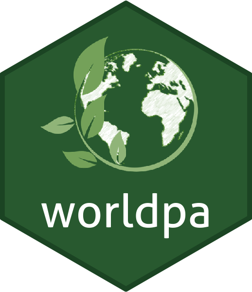

worldpa 
=========================================================

[](https://travis-ci.org/FRBCesab/worldpa)
[](https://ci.appveyor.com/project/FRBCesab/worldpa)
[](https://www.repostatus.org/#active)
[](http://www.gnu.org/licenses/gpl.html)
[](https://zenodo.org/badge/latestdoi/221718108)


Overview
--------

This R package is an interface to the World Database on Protected Areas (WDPA)
hosted on the Protected planet website ([https://www.protectedplanet.net](https://www.protectedplanet.net)). This package is freely released by the [FRB-CESAB](https://www.fondationbiodiversite.fr/en/about-the-foundation/le-cesab/) and allows user to download spatial shapefiles (`simple features`) of protected areas (PA) for world countries using the WDPA API ([https://api.protectedplanet.net](https://api.protectedplanet.net)).


Terms and conditions
--------

You must ensure that the following citation is always clearly reproduced in any publication or analysis involving the Protected Planet Materials in any derived form or format:

> UNEP-WCMC and IUCN (`YEAR`) Protected Planet: The World Database on Protected Areas (WDPA). Cambridge, UK: UNEP-WCMC and IUCN. Available at: www.protectedplanet.net (dataset downloaded the `YEAR/MONTH`).

For further details on terms and conditions of the WDPA usage, please visit the page: [https://www.protectedplanet.net/c/terms-and-conditions](https://www.protectedplanet.net/c/terms-and-conditions).


Prerequisites
--------

This package uses the WDPA API to access data on world protected areas. You must
first have obtained a Personal API Token by filling in the form available at:
[https://api.protectedplanet.net/request](https://api.protectedplanet.net/request).
Then follow these instructions to store this token: [Managing WDPA API Token](https://frbcesab.github.io/worldpa/articles/worldpa.html#managing-wdpa-api-token).


Installation
--------

First, install the package [`devtools`](http://cran.r-project.org/web/packages/devtools/index.html) from the CRAN (if not already installed).

```r
install.packages("devtools", dependencies = TRUE)
```

Then install the `worldpa` package from GitHub.

```r
devtools::install_github("frbcesab/worldpa", build_vignettes = TRUE)
```

:warning: **Note:** Build the vignette only if you already have stored the token.


Getting started
--------

Load the package `worldpa` in the R memory.

```r
library(worldpa)
```

And browse the vignette to get started.

```r
browseURL("https://frbcesab.github.io/worldpa/articles/worldpa.html")
```

Functions documentation can be found at: [https://frbcesab.github.io/worldpa/reference/](https://frbcesab.github.io/worldpa/reference/).

